# COOPERATORS AUTO INSURANCE

Predicting whether a customer will buy auto insurance

The dataset consists of 24 attributes describing 101,891 customers and their vehicles. The goal of the project is to predict whether the customer purchased a policy from Cooperators. The dataset mostly covers the provinces of Ontario, New Brunswick, Prince Edward Island and Newfoundland in Canada.

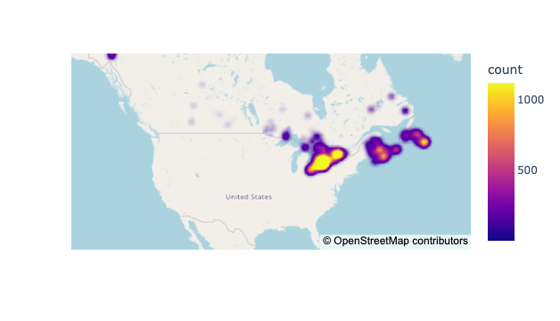
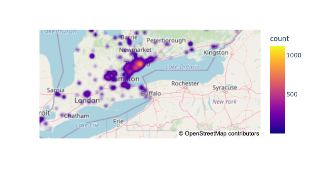
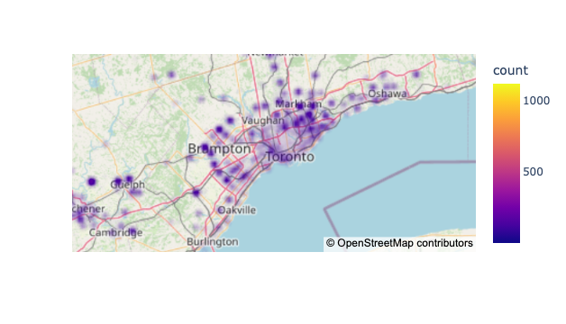

The features describing the customers include:

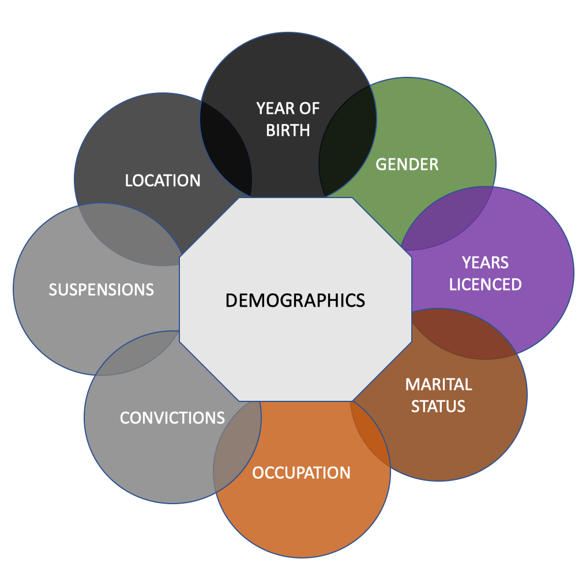
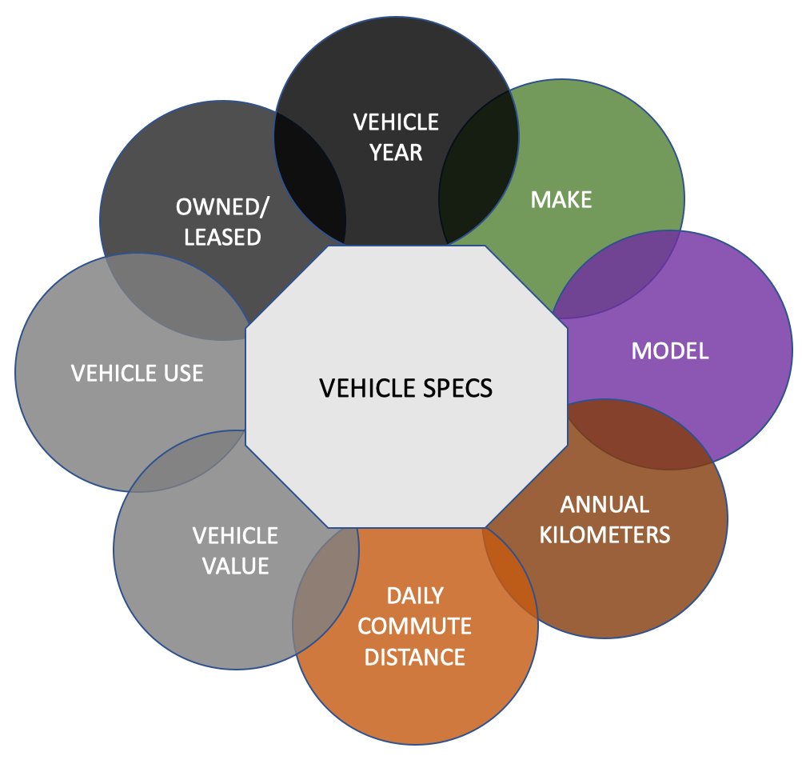

Out of 101,891 customers who asked for an auto insurance quote from Cooperators, only 22% of customers eventually purchased a policy.

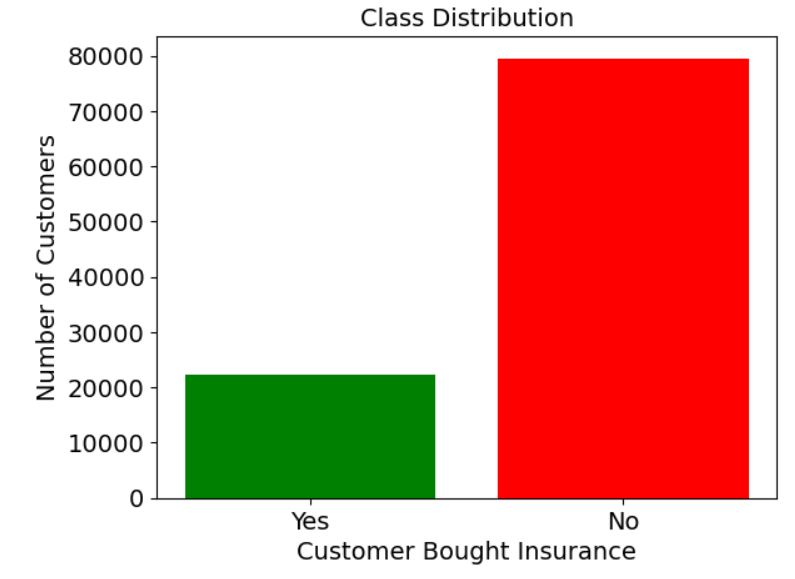

We also looked at regions in Canada that had an above average purchase rate (greater than 22%) with at least 100 customers. Places away from Toronto like Elmira, St. Katherine's, Stratford had above average percentage of customers buying Cooperators policy.

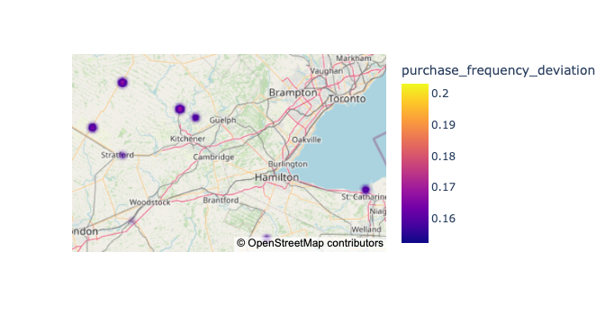

On the contrary, regions closer to Toronto had fewer customers buying Cooperators auto insurance policies (less than 22%) than overall average. 

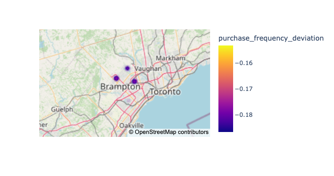

### KEY TAKEAWAYS FROM THE STUDY

Auto insurance policies bundled with other products was the most important feature distinguishing between customers who purchased policies vs. those who didn't. Below we see the the splits between customers who did or didn't purchase multi insurance products. The plot on the left (Observed Distribution) describes the splits that were observed in the dataset whereas plot on the right (Expected Distribution) describes the split if the percentage of customers looking for multi products were the same whether they did or didn't buy insurance. The difference between the observed and expected distribution was statistically significant. 

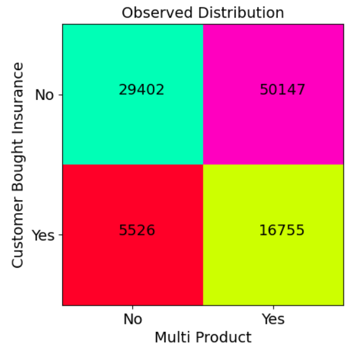
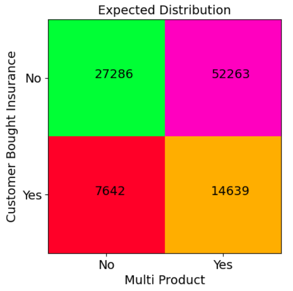

Longitude (going from east to west) was also a statistically significant feature distinguishing between buyers and non-buyers. Non-buyers were more spread out in Canada whereas buyers were concentrated within a narrow band of longitudes, typically within the province of Ontario (along the length of Lake Ontario).

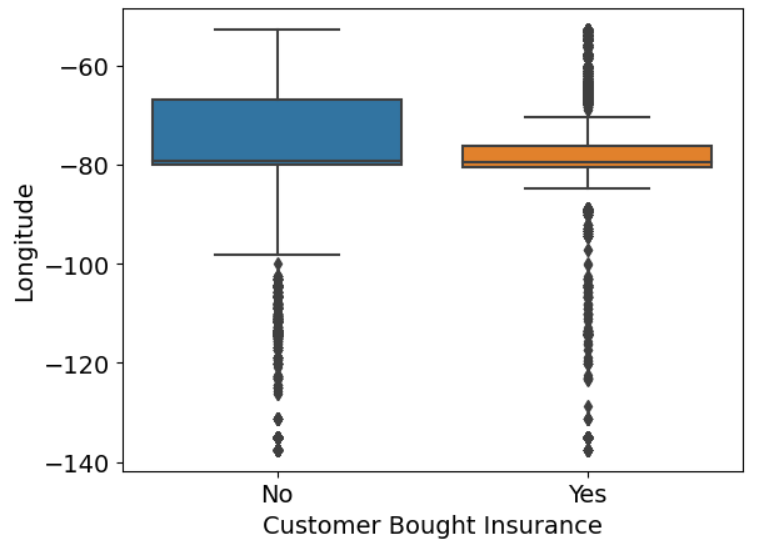

### PREDICTING CUSTOMERS WHO BOUGHT INSURANCE

We trained a model to predict buyers of auto insurance based on their features. We then tested the model on a test dataset of 10,183 (10% of the dataset) customers. The model modestly predicts (ROC AUC = 0.67) if a customer purchased insurance based on the features provided.

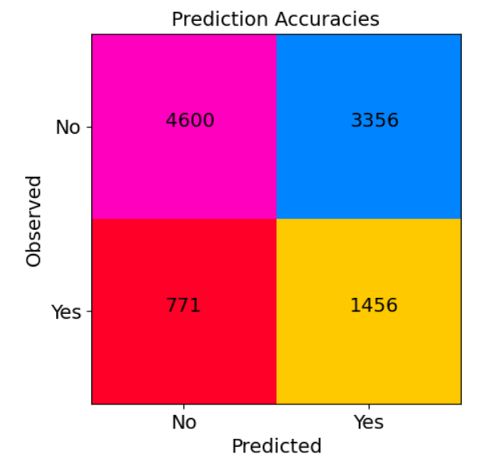

We also looked at features that played the most important role in predicting buyers of insurance. Once again, bundling auto insurance with other products and longitude were the two most important features followed by number of years licenced and age.

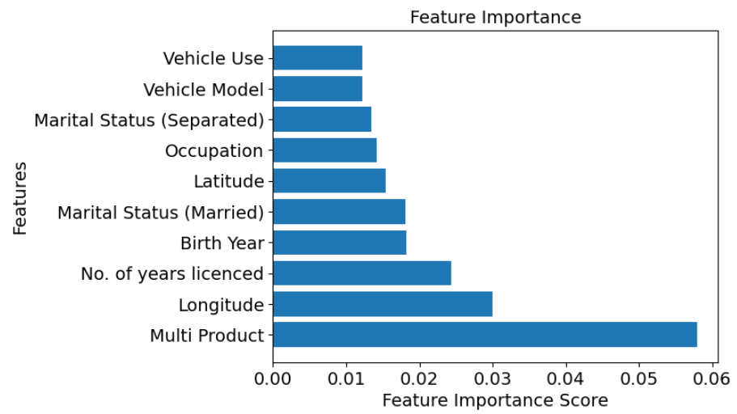

